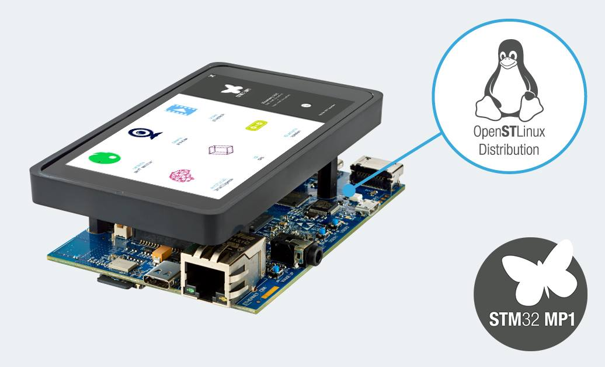

# STM32MP1 OpenSTLinux Projects

Welcome to the STM32MP157F-DK2 Development Board Examples repository! This collection of projects is designed to help you explore and utilize the features of the STM32MP157F-DK2 board. Whether you're a beginner or an experienced developer, these examples aim to provide a clear understanding of various functionalities and guide you through the development process.

## STM32MP157F-DK2 discovery kit
The STM32MP157F-DK2 discovery kit harnesses the power of the STM32MP157 microprocessor, running at an increased frequency of 800MHz. It facilitates easy application development with STM32 MPU OpenSTLinux Distribution for the main processor and STM32CubeMP1 software for the coprocessor. Packed with features, the kit includes an embedded ST-LINK debug tool, LEDs, push-buttons, Ethernet and USB connectors, HDMI transceiver, stereo headset jack, and microSD slot. It supports GPIO expansion for ARDUINO and Raspberry Pi shields, boasts an LCD display with a touch panel, and offers Wi-Fi and Bluetooth Low Energy capabilities.

* STM32MP157 Arm®-based dual Cortex®‑A7 800 MHz 32 bits + Cortex®‑M4 32 bits MPU in a TFBGA361 package
* 4Gbit DDR3L, 1Gbit/s Ethernet (RGMII) compliant with IEEE-802.3ab
* 5V / 3A USB Type-C® power supply input (not provided)
* On-board ST-LINK/V2-1 debugger/programmer with USB reenumeration capability
* STM32CubeMP1 and full mainline open-source Linux® STM32 MPU OpenSTLinux Distribution s/w & examples
* Support of a wide choice of IDEs including IAR Embedded Workbench®, MDK-ARM, and STM32CubeIDE
* 4" TFT 480×800 pixels with LED backlight, MIPI DSI® interface, and capacitive touch pane

For a detailed hardware description and more information, refer to the [STM32MP157x-DKx Hardware Description](https://wiki.stmicroelectronics.cn/stm32mpu/wiki/STM32MP157x-DKx_-_hardware_description).

## Goal
Explore and accelerate STM32MP157F-DK2 development with OpenSTLinux Yocto. This repository provides practical examples, code snippets, and project setups to boost your development on the STM32MP1 platform. Perfect for both beginners and experienced developers. Happy coding! 🚀  

## Repository Hierarchy
### 1. General

The general directory serves as the central hub for essential information and resources related to the STM32MP157F-DK2 board. Find general guidelines, setup instructions, and key references here.

### 2. Project Examples

Explore various project examples organized into dedicated sub-directories. Each project focuses on specific functionalities, allowing you to delve deeper into the capabilities of the STM32MP157F-DK2 board.

##### Build and Deploy

The build and deploy directory provides fundamental information about building and deploying projects on the STM32MP157F-DK2 board. Learn about the necessary tools, setup, and deployment processes.
 
##### Blink LED
This script automates the setup and build process for the BlinkLED project within the Yocto Project environment for STM32MP1.

## Contributing

Your contributions are valuable! Feel free to add new examples, improve existing ones, or share your insights. Together, we can create a comprehensive resource for the STM32MP157F-DK2 development community.

Let's embark on this journey of exploration and development together!